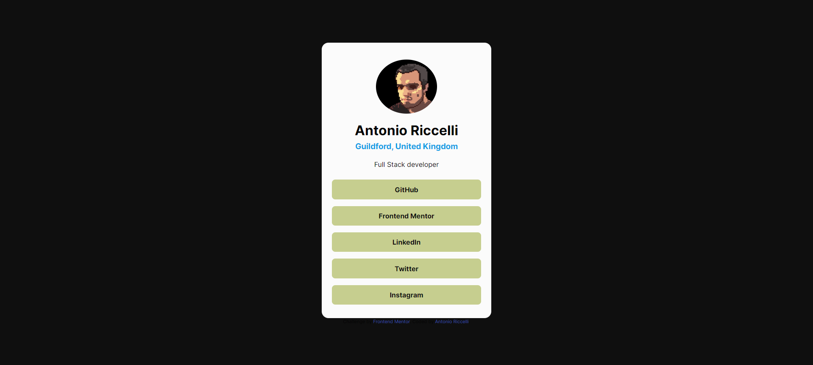

# Frontend Mentor - Social links profile solution

This is a solution to the [Social links profile challenge on Frontend Mentor](https://www.frontendmentor.io/challenges/social-links-profile-UG32l9m6dQ). Frontend Mentor challenges help you improve your coding skills by building realistic projects. 

## Table of contents

- [Frontend Mentor - Social links profile solution](#frontend-mentor---social-links-profile-solution)
  - [Table of contents](#table-of-contents)
  - [Overview](#overview)
    - [The challenge](#the-challenge)
    - [Screenshot](#screenshot)
    - [Links](#links)
  - [My process](#my-process)
    - [Built with](#built-with)
    - [Continued development](#continued-development)
  - [Author](#author)

**Note: Delete this note and update the table of contents based on what sections you keep.**

## Overview

### The challenge

Users should be able to:

- See hover and focus states for all interactive elements on the page

### Screenshot

### Links

- Solution URL: [GitHub Repo](https://github.com/Antonio-Riccelli/frontend-mentor-social-links-profile)
- Live Site URL: [GitHub Pages](https://antonio-riccelli.github.io/frontend-mentor-social-links-profile/)

## My process

### Built with

- Semantic HTML5 markup
- CSS custom properties
- Flexbox

### Continued development

Topics to keep focusing on are: 
- Typography
- Responsiveness
- Accessibility

**Note: Delete this note and the content within this section and replace with your own plans for continued development.**

## Author

- Website - [Antonio Riccelli](https://www.antonioriccelli.com)
- Frontend Mentor - [@Antonio-Riccelli](https://www.frontendmentor.io/profile/Antonio-Riccelli)

